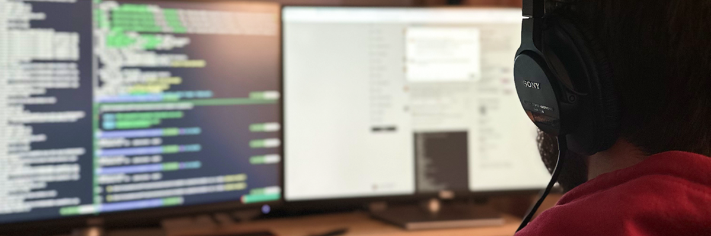
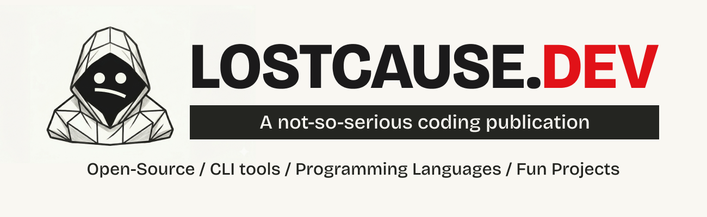

# Hey, I'm Razvan 🙋

Indie maker building my own apps. Ten years as a freelancer, then running a tech outsourcing company. Now working on my own apps.

## lostcause.dev

**A not-so-serious coding publication about open source, CLI tools, programming languages, and fun projects.**

I've been writing code for over ten years. Then AI came along, and I didn't want vibe-coding to become the only way I write code. So this is me relearning in public: vanilla projects, new languages, open-source contributions, honest tool reviews, failed experiments, those kinds of things.

- Website: [lostcause.dev](https://lostcause.dev)
- GitHub: [Lost Cause Publication](https://github.com/LostCausePublication) (open-source projects from the publication)

### Some of my articles

- [Self-host your analytics for $4 per month - Getting started with GoatCounter](https://lostcause.dev/blog/self-host-your-analytics-for-4-per-month?ref=github)
- [Why this publication exists](https://lostcause.dev/blog/why-this-publication-exists?ref=github)

**The complete list of articles: [https://lostcause.dev/authors/razvanmuntian](https://lostcause.dev/authors/razvanmuntian?ref=github)**

## Find me online

- Website: [razvanmuntian.com](https://razvanmuntian.com)
- X: [@razvanmuntian](https://x.com/razvanmuntian)
- LinkedIn: [razvanmuntian](https://www.linkedin.com/in/razvanmuntian)
- Bluesky: [@razvanmuntian.com](https://bsky.app/profile/razvanmuntian.com)
- GitHub: [@razvanmtn](https://github.com/razvanmtn)

## Free Tools

- [instavisuals.com](https://instavisuals.com?ref=github)
- [checkyourwebcam.com](https://checkyourwebcam.com?ref=github)
- [textdiff.dev](https://textdiff.dev?ref=github)
- [svgtogif.com](https://svgtogif.com?ref=github)

## Projects

### Open source

| Project | Description |
|---------|-------------|
| [TechTerms.io](https://github.com/techterms/techterms) (Archived) | Community-powered tech glossary for learning hard terms |
| [IndieMakerNotes.com](https://indiemakernotes.com) | Note-taking framework for indie makers |

### Commercial

| Project | Description |
|---------|-------------|
| [LunaFinder.com](https://lunafinder.com) | Privacy-first photo explorer. No subscriptions, no cloud snooping |
| [TypoQuiz.com](https://typoquiz.com) | Typing tests to improve speed and accuracy |
| [Boring Papers](https://boringpapers.com) | Professional invoices for entrepreneurs and indie makers |

[See all tech projects](https://razvanmuntian.com/tech-projects)

## Travel and remote work

I also write about travel under a different hat.

I'm not a full-time nomad. I take longer trips, usually two to four weeks or more, and work remotely while I'm there. Recent stops include Romania 🇷🇴, Thailand 🇹🇭, Portugal 🇵🇹, and Greece 🇬🇷.

**Travel writer and remote worker. I take long trips and write honestly about all of it.**

I share cities I recommend, coworking spots, food, things to visit, and whether a place works for nomading. Travel tips, packing, money, how to book a trip, all from my own experience, including what I got wrong.

- Website: [razvanmuntian.com](https://razvanmuntian.com)
- Substack: [razvanmuntian.substack.com](https://razvanmuntian.substack.com)
- YouTube: [@razvanmuntian](https://www.youtube.com/@razvanmuntian)
- Instagram: [@razvanmuntian](https://www.instagram.com/razvanmuntian)
- TikTok: [@razvanmuntian](https://www.tiktok.com/@razvanmuntian)
